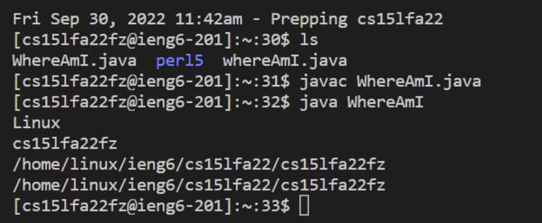
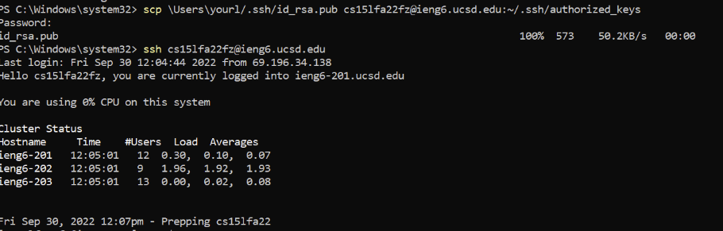

# Week 1 Lab Report
## Step 1. Installing VScode
* Go to [VScode](https://code.visualstudio.com/) and install VScode for Windows or Mac depending on your device
* When you finish the download and open VScode it should look like this.

* Personally I did not install VScode because I already had it installed before for personal use.

## Step 2. Remotely Connecting
* First find the course specific CSE15L account here [Acc Lookup](https://sdacs.ucsd.edu/~icc/index.php)
* To reset the password for the account follow this tutorial [Reset Password Tutorial](https://docs.google.com/document/d/1hs7CyQeh-MdUfM9uv99i8tqfneos6Y8bDU0uhn1wqho/edit) after resetting the password you might have to wait 15 minutes to two hours.
* Install [OpenSSH](https://learn.microsoft.com/en-us/windows-server/administration/openssh/openssh_install_firstuse?tabs=gui) if you are on windows, make sure you install OpenSSH Client not server.
* Open up the terminal in VScode and type in `ssh cs15lfazz@ieng6.ucsd.edu` but replace the `zz` with your own course specific acc.
* Say yes when this screen pops out. 

* Type in the password and you should get a screen like this. 
* Personally I was stuck on this step because it was taking forever for my password change to go through I think it was because there was a lot of people changing there password at the same time. I eventually got it to work once I got home around eight hours later.

## Step 3. Trying Some Commands
* Try `cd`, `ls`, `pwd`, `mkdir`, and `cp` on both the computer and remotely through ssh.
* Try other commands like `cd ~`, `cd`, `ls -lat`, `ls -a`, `ls <directory>` where `<directory>` is `/home/linux/ieng6/cs15lfa22/cs15lfa22abc` and `abc` is someone elses acc. Example of what the commands do 

## Step 4. Moving Files with `scp`
* Create a file called WhereAmI.java and put this code into the file
```
class WhereAmI {
  public static void main(String[] args) {
    System.out.println(System.getProperty("os.name"));
    System.out.println(System.getProperty("user.name"));
    System.out.println(System.getProperty("user.home"));
    System.out.println(System.getProperty("user.dir"));
  }
}
```
* In the terminal run ` scp WhereAmI.java cs15lfa22zz@ieng6.ucsd.edu:~/ ` replacing zz with your own acc and enter your password when it prompts.
* Log in using `ssh cs15lfa22zz@ieng6.ucsd.edu` and us `ls`. WhereAmI.java should be there.
* Run `javac WhereAmI.java` and `java WhereAmI` remotely. It should look like this 

## Step 5. SSH Keys
* Run on the terminal `ssh-keygen`. You should get an image like this 
* If on windows run `ssh-add` from this tutorial [ssh-add](https://docs.microsoft.com/en-us/windows-server/administration/openssh/openssh_keymanagement#user-key-generation).

## Step 6 Optimizing Remote Running
* Here we are going to optimize logging into ssh without typing in a password each time.
* Run `ssh cs15lfa22zz@ieng6.ucsd.edu` on the client and enter your password
* Run `mkdir .ssh` on the server. If the file already exists then `logout`
* On the client run `scp /Users/joe/.ssh/id_rsa.pub cs15lfa22@ieng6.ucsd.edu:~/.ssh/authorized_keys` where in place of joe is your user with your account for cs15lfa22fz@ieng6.ucsd.edu.
* Once this is you should be able to `ssh cs15lfa22fz@ieng6.ucsd.edu` without a password like this 