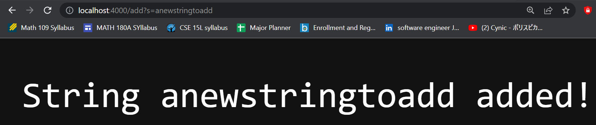
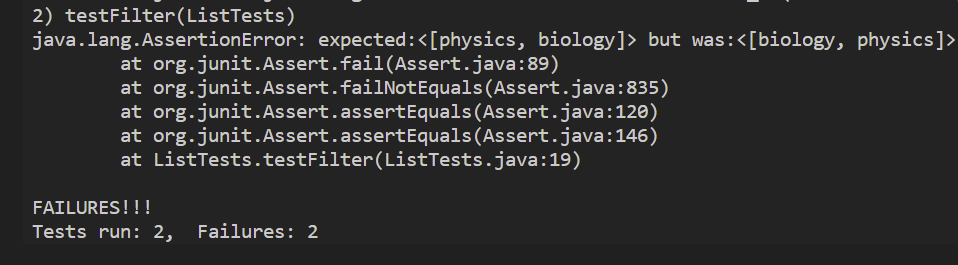
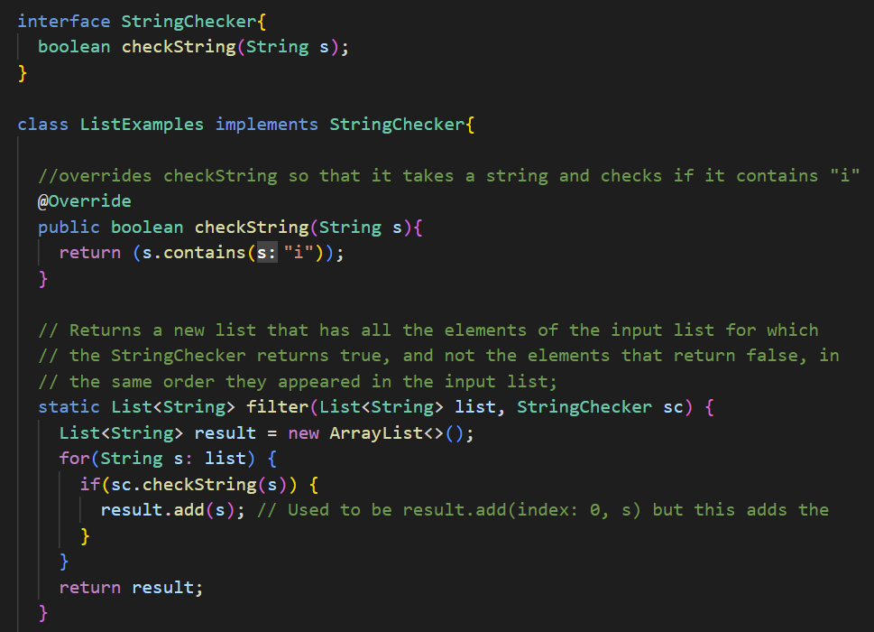

# Week 3 Lab Report
## Part 1
```
class Handler implements URLHandler {
    List<String> str = new ArrayList<String>();
    public String handleRequest(URI url) {
        if (url.getPath().equals("/")) {
            return String.format("String: %s", str);
        }

        else if (url.getPath().equals("/add")) {
            String[] parameters = url.getQuery().split("=");
            str.add(parameters[1]);
            return String.format("String %s added!", parameters[1]);
        } else {
            // System.out.println("Path: " + url.getPath());
            if (url.getPath().contains("/search")) {
                List<String> str2 = new ArrayList<String>();
                String[] parameters = url.getQuery().split("=");
                for (String s : str) {
                    if (s.contains(parameters[1])) {
                        str2.add(s);
                    }
                }
                String comma = ",";
                String finalStr = String.join(comma, str2);
                return finalStr;
            }
            return "404 Not Found!";
        }
    }
}
```




## Part 2
### Bug 1 **ArrayExamples: averageWithoutLowest**
* The first bug that I am choosing for my lab report would be the averageWithoutLowest function in the ArrayExamples file.
* This is the original failure inducing input that I tested using an array with (0.2, 1, 5, 6, 0.7) as my first test and an empty array as my second test. 
* Running the test I got the symptons in the image below which says that it expected the value of 2.54 but instead returned 3.175. 
* Looking at the code I realized the that bug was in the return statement.The code was `return sum / (arr.length -1)` when it should have been ` return sum / arr.length`. 
* The connection between the sympton and the bug is that the sympton is looking for the average of the array without the lowest number; however,in the bug it is taking the average of the array without factoring in the fact that the lowest number is still an element in the array. The sympton is looking for `sum/arr.length` while the bug is outputing `sum/(arr.length - 1)`.
* This bug causes this sympton for this particular input because the input will sum into `12.7` which divided by `arr.length` is the equate to `2.54`; however, the bug is `sum/(arr.length-1)` which means it is taking the average of one less element of the array which causes the sympton of `3.175`.

### Bug 2 **ListExamples: merge**
* The second bug that I am choosing for my lab report would be the merge function in the ListExamples file.
* This is the original failure inducing input that I tested using a string list with inputs (` "physics" `, ` "math" `,` "biology" `) 
* Running the test I got the symptons in the image below which says that it expected the array `[physics, biology]` and it returned `[biology, phyiscs]`. 
* Looking at the code I realized that the problem lay in the line where it said `result.add(index: 0, s)`. Instead of putting the array back in the same order the code was reversing the array after checking the string. The fix I implemented was replacing the code with `result.add(s)` as shown in the image below. 
* The sympton was looking for the original array in the same order with strings that did not have `i` removed. On the other hand, the bug was outputing the original array in reverse order with strings that did not have `i`. 
* This bug causes this sympton for this particular input because the function will filter out the `math` string becuase it does not contain the string `s` and then make a place the strings that do containt `s` into the array result. The problem is that it adds the string into index 0 which will essentially reverse the array. This bug would affect every single type of input and give the same sympton of reversing the array each time.