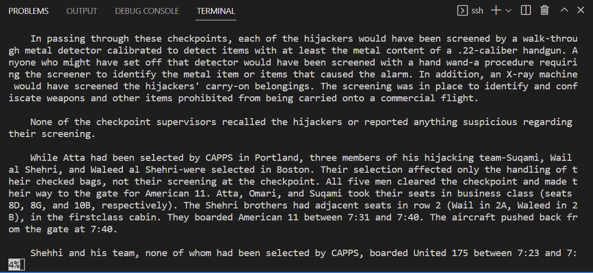
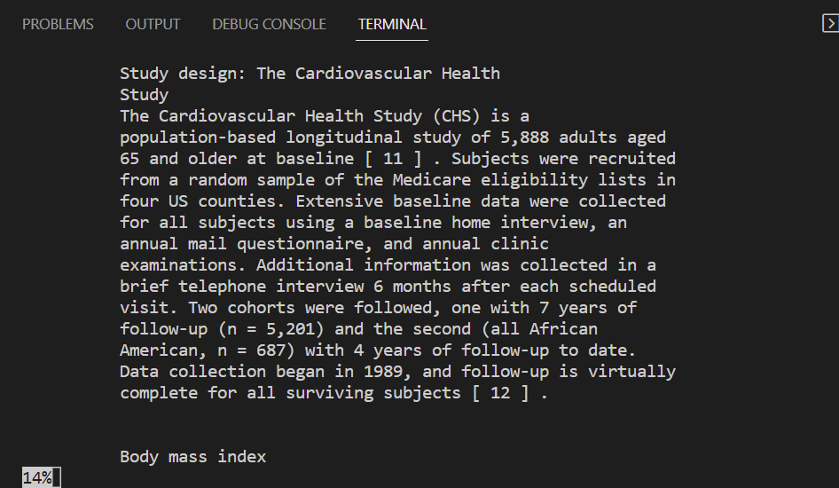
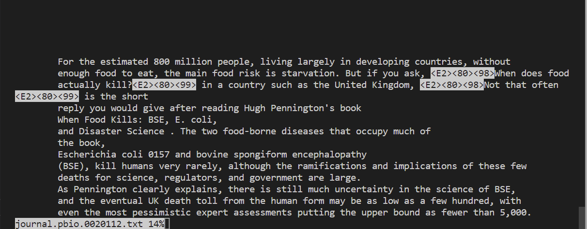
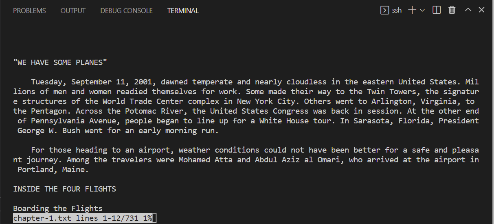
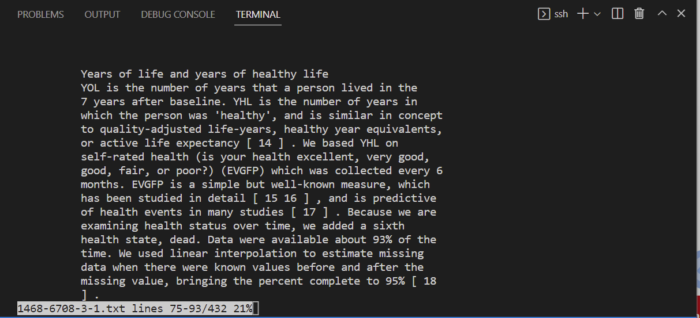
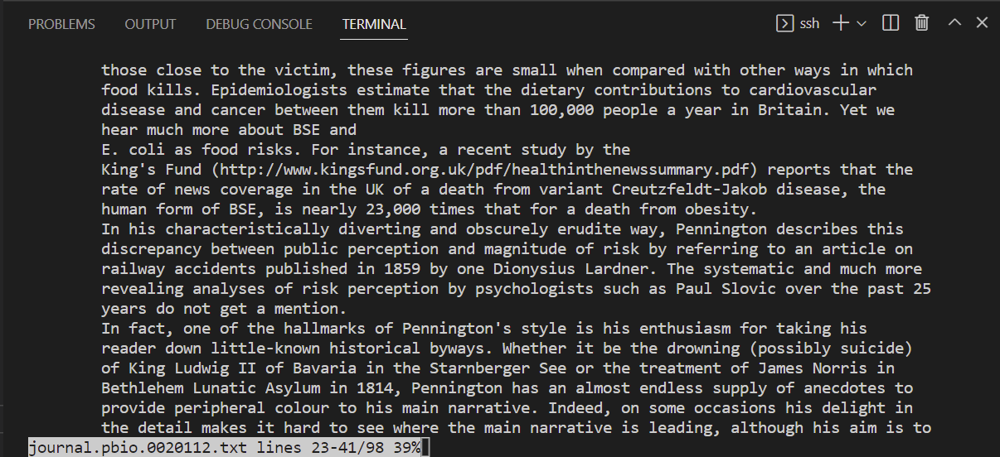
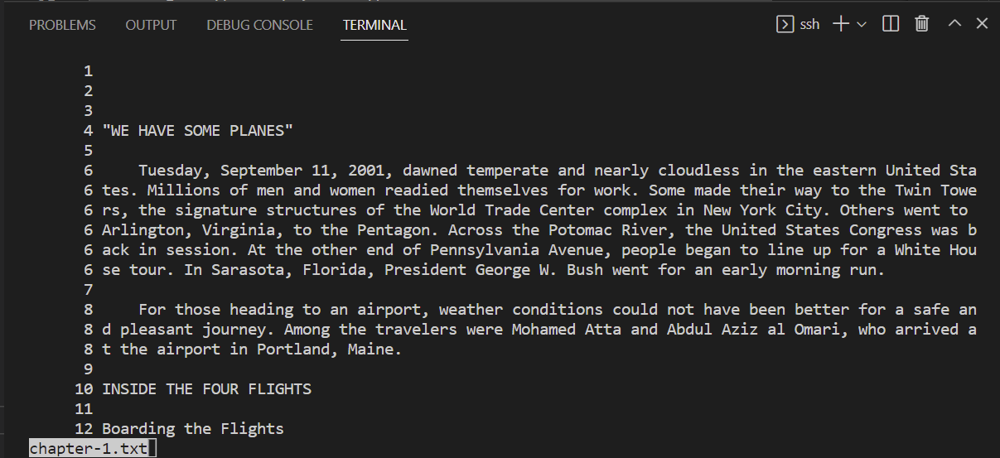
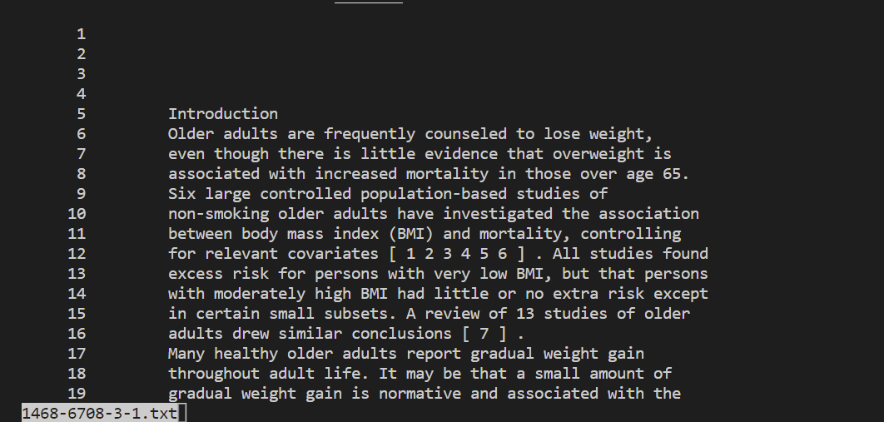
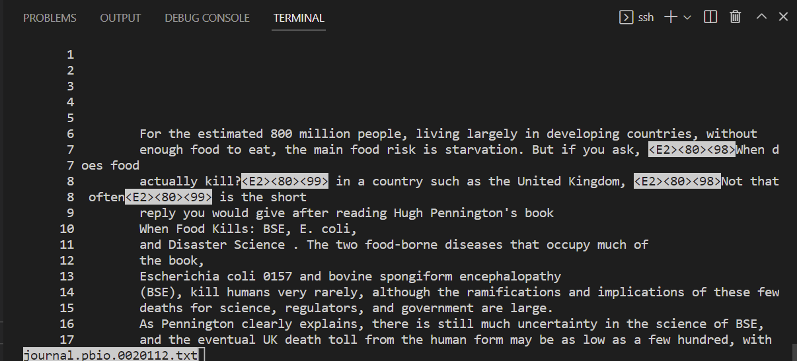

# Week 5 Lab Report
## less Command
The `less` command is a command line utility in linux that displays the contents of a file or command input, one page at a time. Compared to `vim` or `nano` the less command does not read the entire file but loads the file one page at a time which gives faster load speeds.

## less -m
* The command-line option -m, shows how much percentage of the file you have gone through. The percentage updates until you reach the end where it will be 100%

### Example 1

Input
```
cd 911report
less -m chapter-1.txt
```

Output 
* Explanation: In this example we started in the techincal folder then went into the 911report folder to use the less -m command-line option on a file. In the screenshot there is a percentage at the bottom of the tile and it shows us how much of the file has been gone through. This is useful as it can tell the user where in the file they exactly are.

### Example 2

Input
```
cd biomed
less -m 1468-6708-3-1.txt
```

Output 
* Explanation: In this example we started in the techincal folder then went into the biomed folder to use the less -m command-line option on a file. In the screenshot there is a percentage at the bottom of the tile and it shows us how much of the file has been gone through. This is useful as it can tell the user where in the file they exactly are.
### Example 3

Input
```
cd plos
less -m journal.pbio.0020112.txt
```
Output 
* Explanation: In this example we started in the techincal folder then went into the plos folder to use the less -m command-line option on a file. In the screenshot there is a percentage at the bottom of the tile and it shows us how much of the file has been gone through. This is useful as it can tell the user where in the file they exactly are.

## less -M
* The command-line option -M, is a more advanced version of the -m command-line option. In addition to showing the percentage like -m it also shows which lines you are looking at out of the total number of lines in the file.
### Example 1

Input
```
cd 911report
less -M chapter-1.txt
```

Output 
* Explanation: In this example we started in the techincal folder then went into the 911report folderto use the less -M command-line option on a file. This command reveals the lines you are looking at out of the total lines in the file in addition to showing how much of the file you have gone through as a percentage. This command is useful for keeping track of how much of the file you have gone through or what lines you are looking at
### Example 2

Input
```
cd biomed
less -M 1468-6708-3-1.txt
```

Output 
* Explanation: In this example we started in the techincal folder then went into the biomed folder in order to use the less -M command-line option on one of the files. This command reveals the lines you are looking at out of the total lines in the file in addition to showing how much of the file you have gone through as a percentage. This command is useful for keeping track of how much of the file you have gone through or what lines you are looking at
### Example 3

Input
```
cd plos
less -M journal.pbio.0020112.txt
```
Output 
* Explanation: In this example we started in the techincal folder then went into the plos folder in order to use the less -M command-line option on one of the files. This command reveals the lines you are looking at out of the total lines in the file in addition to showing how much of the file you have gone through as a percentage. This command is useful for keeping track of how much of the file you have gone through or what lines you are looking at.


## less -N
* The command-line option -N, shows the line numbers at the begining of each line

### Example 1

Input
```
cd 911report
less -N chapter-1.txt
```

Output 
* Explanation: Here we go into the 911report folder to use the less -N on a file. As shown in the screenshot above the line numbers are on the left at the begining of each time. This could be useful for citing as now users dont have to manually count lines if they want to cite text.
### Example 2

Input
```
cd biomed
less -N 1468-6708-3-1.txt
```

Output 
* Explanation: Here we go into the biomed folder to use the less -N on a file. As shown in the screenshot above the line numbers are on the left at the begining of each time. This could be useful for citing as now users dont have to manually count lines if they want to cite text.
### Example 3

Input
```
cd plos
less -N journal.pbio.0020112.txt
```
Output 
* Explanation: Here we go into the plos folder to use the less -N on a file. As shown in the screenshot above the line numbers are on the left at the begining of each time. This could be useful for citing as now users dont have to manually count lines if they want to cite text.
