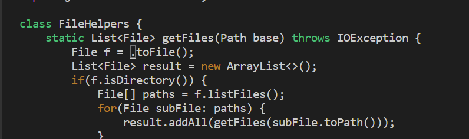

# Week 7 Lab Report
## Part 1
The task I chose to repeat was "In `DocSearchServer.java`, change the name of the `start` parameter of `getFiles`, and all of its uses, to instead be called ``base``"
### Vim Sequence
* `vim DocSearchServer.java<Enter>` 
* `\start<Enter>` 
* `dw` and then `i` 
* `base<Esc>` 
* `\start<Enter>` 
* `dw` and then `i` 
* `base<Esc>` 
* `\start<Enter>` 
* `dw` and then `i` 
* `base<Esc>` 
* `:wq<Enter>`

## Part 2
* Editing the file in Visual Studio and then `scp` the file into remote took me arouund three minutes and twenty seconds. The main difficulty of editing in this style was trying to type out the `scp` command. Many times I typed it out incorrectly and as a result had a time loss. The actual editing of the file in visual code was very fast and I only took around one minute for the actual edit. In addition after editing the file it also took time to remotely `ssh` into the account.
* Starting logged in to the `ssh` session and editing using Vim took me around two minutes and twenty seconds. Compared to editing the file in visual studio, editing the file in Vim took significantly longer. In addition, editing in Vim also made me make many errors such as accidentally pressing `<enter>` in insert mode instead of `<esc>`. Another difficulty I had while I was editing in Vim was the fact that im not experienced on Vim so my keystrokes were not as accurate as editing in visual studio.
* If I had to run a program remotely I would prefer to edit it in Visual Studio as I feel more comfortable on this software compared to using Vim. 
* If the project or task was very big and involved multiple files I would change to editing in Vim over Visual studio because it would be extremely cumbersome to `scp` each edited file directly into the remote. In addition, if the file is very big `scp` may take a long time to copy the file over.
 
