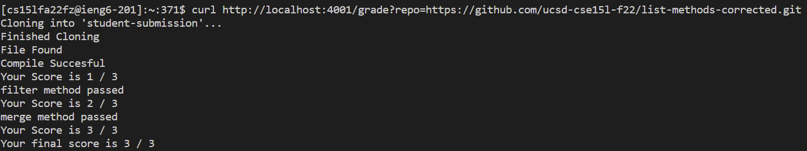
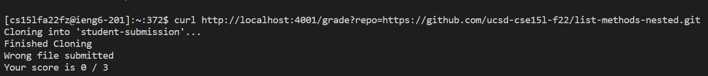
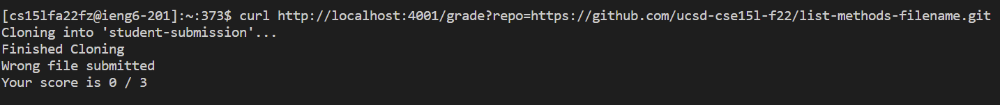

# Week 9 Lab Report
## grade.sh
```
CPATH="..:../lib/hamcrest-core-1.3.jar:../lib/junit-4.13.2.jar"
point=0
rm -rf student-submission
git clone $1 student-submission
echo "Finished Cloning"
cd student-submission
if [[ -e "ListExamples.java" ]]
    then
        echo "File Found"
    else
        echo "Wrong file submitted"
        echo "Your score is $point / 3"
        exit 1
fi 
javac -cp $CPATH *.java
if [[ $? -eq 0 ]]
    then
        let "point+=1"
        echo "Compile Succesful"
        echo "Your Score is $point / 3"
    else 
        echo "Compilation Failed"
        echo "Your Score is $point / 3" 
        exit 1
fi 
java -cp $CPATH org.junit.runner.JUnitCore TestListExamples > tester.txt
if [[ $(grep -c "filter" tester.txt) -eq 0 ]]
    then
        let "point+=1"
        echo "filter method passed"
        echo "Your Score is $point / 3"
    else 
        echo "filter method failed"
fi
if [[ $(grep -c "merge" tester.txt) -eq 0 ]]
    then
        let "point+=1"
        echo "merge method passed"
        echo "Your Score is $point / 3"
    else 
        echo "merge method failed"
fi
echo "Your final score is $point / 3"
```
## grade.sh on Student Submissions
* [Submission 1](https://github.com/ucsd-cse15l-f22/list-methods-corrected.git)
* 
* [Submission 2](https://github.com/ucsd-cse15l-f22/list-methods-nested.git)
* 
* [Submission 3](https://github.com/ucsd-cse15l-f22/list-methods-filename.git)
* 

## Tracing
* We will trace grade.sh on [Submission 1](https://github.com/ucsd-cse15l-f22/list-methods-corrected.git)
* The table below shows the stdout, stderr, and exit code of each line of code

| Line  	| stdout                    	| stderr                               	| exit code 	|
|-------	|---------------------------	|--------------------------------------	|-----------	|
| 3     	| empty                     	| empty                                	| 0         	|
| 4     	| empty                     	| empty                                	| 0         	|
| 5     	| Finished Cloning          	| empty                                	| 0         	|
| 6     	| empty                     	| empty                                	| 0         	|
| 7     	| if statement true         	| list examples found                  	|           	|
| 8     	| empty                     	| empty                                	| 0         	|
| 9     	| File Found                	| empty                                	| 0         	|
| 10-13 	| else statement doesnt run 	|                                      	|           	|
| 14    	| empty                     	| empty                                	| 0         	|
| 15    	| empty                     	| empty                                	| 0         	|
| 16    	| if statement true         	| javac compiled works                 	|           	|
| 17    	| empty                     	| empty                                	| 0         	|
| 18    	| empty                     	| empty                                	| 0         	|
| 19    	| Compile Successful        	| empty                                	| 0         	|
| 20    	| Your Score is 1/3         	| empty                                	| 0         	|
| 21-24 	| else statement doesnt run 	|                                      	|           	|
| 25    	| empty                     	| empty                                	| 0         	|
| 26    	| empty                     	| empty                                	| 0         	|
| 27    	| if statement true         	| grep finds filter method inside file 	|           	|
| 28    	| empty                     	| empty                                	| 0         	|
| 29    	| empty                     	| empty                                	| 0         	|
| 30    	| filter method passed      	| empty                                	| 0         	|
| 31    	| Your Score is 2/3         	| empty                                	| 0         	|
| 32-33 	| else statement doesnt run 	|                                      	|           	|
| 34    	| empty                     	| empty                                	| 0         	|
| 35    	| if statement true         	| grep finds merge method inside file  	|           	|
| 36    	| empty                     	| empty                                	| 0         	|
| 37    	| empty                     	| empty                                	| 0         	|
| 38    	| merge method passed       	| empty                                	| 0         	|
| 39    	| Your Score is 3/3         	| empty                                	| 0         	|
| 40-41 	| else statemet doesnt run  	|                                      	|           	|
| 42    	| empty                     	| empty                                	| 0         	|
| 43    	| Your Final Score is 3/3   	| empty                                	| 0         	|